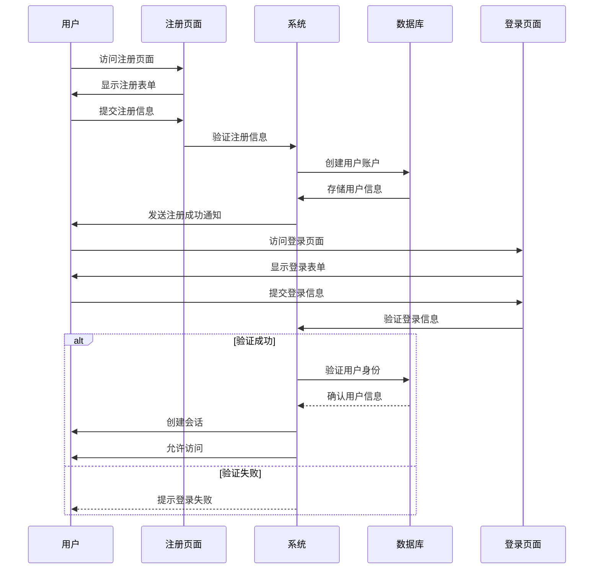

```mermaid
sequenceDiagram
    participant U as 用户
    participant R as 注册页面
    participant S as 系统
    participant D as 数据库
    participant L as 登录页面

    U->>R: 访问注册页面
    R->>U: 显示注册表单
    U->>R: 提交注册信息
    R->>S: 验证注册信息
    S->>D: 创建用户账户
    D->>S: 存储用户信息
    S->>U: 发送注册成功通知

    U->>L: 访问登录页面
    L->>U: 显示登录表单
    U->>L: 提交登录信息
    L->>S: 验证登录信息
    alt 验证成功
        S->>D: 验证用户身份
        D-->>S: 确认用户信息
        S->>U: 创建会话
        S->>U: 允许访问
    else 验证失败
        S-->>U: 提示登录失败
    end
```
